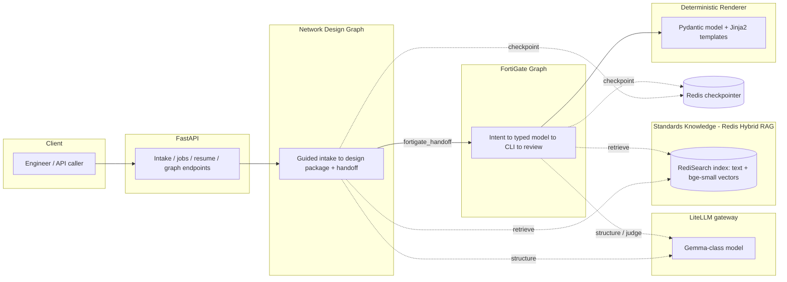
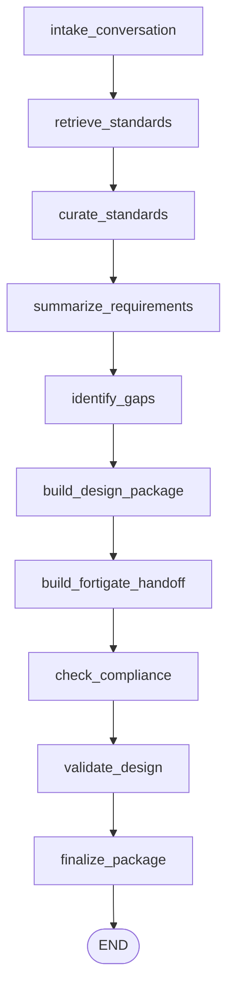
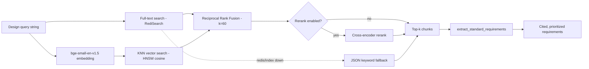
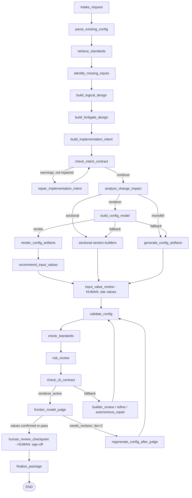
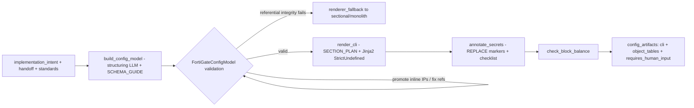
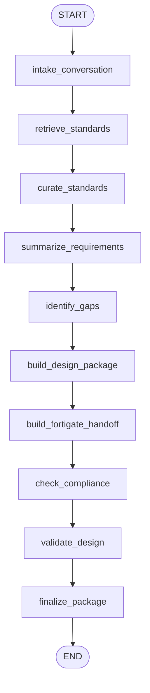
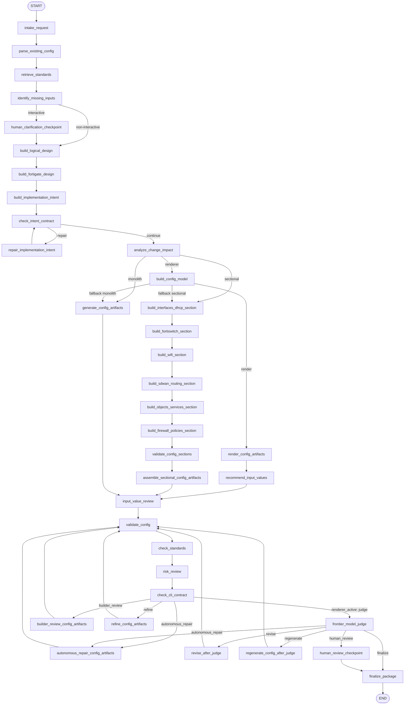

# Standards-Aware, Deterministic Network Design & FortiGate Configuration Generation

**By Chris MacFarland**
*Authored with Claude Opus 4.8.*

**Date:** Wednesday, June 3, 2026
**Version:** v1.0

---

### Abstract

This whitepaper describes a production system that turns a network engineer's design conversation into a syntactically valid, standards-grounded, draft FortiGate configuration without betting correctness on a language model. The system pairs two LangGraph state machines — a Network Design helper and a FortiGate configuration generator — with a Redis-backed hybrid retrieval corpus of Fortinet, CIS, and best-practice standards. Its defining choice is *deterministic rendering*: the language model fills a strictly-typed Pydantic configuration model, and a Jinja2 renderer — not the model — emits the FortiOS CLI. The result is configuration that is reproducible, referentially consistent, standards-cited, and explicitly draft-only, with mandatory human confirmation of every site-specific value before anything could be deployed.

---

## 1. Executive Summary

Network engineering teams spend enormous effort translating a customer's intent ("dual-WAN branch with a guest SSID, segmented VLANs, and CIS-aligned hardening") into device-ready FortiGate CLI. That translation is slow, inconsistent between engineers, error-prone in its cross-references, and difficult to keep aligned with internal standards and external benchmarks. The obvious shortcut — asking a large language model to "write the FortiGate config" — fails in practice: raw LLM-generated CLI is non-deterministic, frequently references objects it never defines, silently invents secrets and public IP addresses, and cannot be trusted to paste into a device.

This system takes a different position. A language model is excellent at *structuring intent* and poor at *guaranteeing syntax and references*, so we let it do only the former. The model produces a typed configuration model; a deterministic renderer produces the CLI. Referential integrity is enforced by construction at model-validation time, the renderer emits stanzas in strict dependency order, secrets are never invented and are flagged for replacement, and every unknown site value becomes a mandatory human question. Two coordinated LangGraph graphs implement this: a **Network Design** graph that runs a guided, twelve-topic intake and emits a standards-grounded design package plus a FortiGate handoff, and a **FortiGate** graph that converts the handoff into a validated, judged, human-reviewed draft configuration.

The payoff is a configuration pipeline whose correctness does not depend on the model behaving well on any given run. On the deterministic renderer path the CLI is syntactically valid by construction, the same inputs render the same output, and the only human burden is confirming the site-specific values the system deliberately refused to guess.

---

## 2. The Problem (WHY)

### 2.1 Manual configuration does not scale with quality

A modern FortiGate branch configuration spans a dozen interdependent domains — interfaces and VLANs, zones, DHCP, address and service objects, SD-WAN members and health checks, static and SD-WAN-steered routes, NAT/VIP, IPsec and SSL VPN, UTM security profiles, FortiSwitch/FortiLink, managed wireless, system hardening, administrative access, and firewall policy. Each domain references the others: a firewall policy names zones, address objects, and services that must already exist; an SD-WAN service references members and health checks by sequence number and name; a VLAN interface requires a parent. Hand-authoring this correctly, consistently, and in compliance with both internal standards and the CIS FortiGate Benchmark is genuinely hard, and it does not get easier with volume.

### 2.2 Raw LLM-generated CLI is unsafe to deploy

Asking a model to emit CLI directly exhibits failure modes that are unacceptable for network equipment:

- **Non-determinism.** The same request yields different configs on different runs, defeating review, auditing, and reproducibility.
- **Dangling references.** Policies reference address objects, zones, or services that were never defined; SD-WAN services reference undefined health checks. The CLI looks plausible and fails (or worse, partially applies) on the device.
- **Invented secrets and site values.** Models happily fabricate PSKs, public IP addresses, gateways, DNS/NTP/syslog servers, and SNMP communities. A fabricated value that looks real is more dangerous than an obvious blank.
- **Ordering errors.** A zone that references an interface defined later in the file will not apply cleanly.
- **Silent burial.** Unknown values get quietly filled with guesses instead of being surfaced for human input.

### 2.3 The intent-to-config gap

Between a design discussion and a device-ready config sits a gap that neither pure automation nor pure LLM generation closes safely. Templates alone cannot absorb free-form intent; raw generation cannot guarantee safety. The approach in this whitepaper closes the gap by splitting it: a model carries intent into a *typed structure*, and deterministic machinery carries that structure into *valid CLI*. Correctness lives in the deterministic half, where it can be enforced and tested.

---

## 3. Design Philosophy / Principles

The system is built on a small set of non-negotiable principles, each of which is directly visible in the code.

1. **Standards-aware.** Every design and configuration step is grounded in a retrieved corpus of Fortinet documentation, the CIS Benchmark, and best-practice guides. Retrieval happens before structuring, and citations flow through to the package.
2. **Deterministic rendering.** The LLM produces a structured `FortiGateConfigModel`, never raw CLI. The Jinja2 renderer turns that model into FortiOS 7.4 CLI in a pure, side-effect-free function. This is the central architectural decision of the system.
3. **Human-in-the-loop for values and sign-off.** The graph deliberately pauses to make a human confirm site-specific values (which changes the rendered config) and again to approve the draft (sign-off). Nothing is presented as "applied".
4. **Placeholder discipline.** Unknown site-specific values and all secrets are emitted as explicit `Placeholder` tokens, collected automatically into a human-input list, and — for true secrets — annotated in the CLI with a replace-before-deployment marker. The system never silently invents or buries a value.
5. **Model-agnostic robustness.** The pipeline tolerates any model's JSON quirks: stringified placeholders are coerced back into objects, common field confusions are auto-corrected, and questions are built from the full rendered token set rather than from whatever the model happened to declare.
6. **Draft-only safety.** Every artifact carries a `DRAFT ONLY - NOT APPLIED TO DEVICE` label, and prompts and validators repeatedly reinforce that no device change is ever made.

---

## 4. System Architecture Overview

### 4.1 Components and technology stack

| Layer | Technology | Role |
| --- | --- | --- |
| Orchestration | **LangGraph** state machines (`StateGraph` + `AsyncRedisSaver` checkpointer) | Two graphs: Network Design and FortiGate generation, both checkpointed for resumable, interruptible runs |
| API | **FastAPI** | HTTP endpoints for chat-style intake, jobs, resume, and graph visualization |
| Model serving | **LiteLLM** gateway fronting a self-hosted **Gemma**-class model (default model id `gemma-local`; context-window fallback `extl-gemma-4-31b`) | All generation/structuring/judging via the OpenAI-compatible `ChatOpenAI` client; model-agnostic by design |
| Retrieval | **Redis** (RediSearch HASH index, HNSW vector field) with **BAAI/bge-small-en-v1.5** embeddings (384-dim) | Hybrid full-text + vector retrieval with Reciprocal Rank Fusion over the standards corpus |
| Schema | **Pydantic** (`FortiGateConfigModel` and ~30 sub-models) | Strict typing + referential-integrity validators that fail loudly before any CLI is produced |
| Rendering | **Jinja2** templates under `app/templates/fortios/7.4/` | Pure, deterministic CLI emission in dependency order |

### 4.2 How the pieces fit

A request enters through FastAPI. The Network Design graph runs a guided intake, retrieves standards, and emits a design package plus a FortiGate handoff payload. That handoff seeds the FortiGate graph, which structures intent into a typed model, renders CLI deterministically, validates it, has an independent "judge" model review it, and pauses for human confirmation of site values and final sign-off. Both graphs persist state to Redis so a run can be interrupted at a human checkpoint and resumed later.

---

## 5. The Network Design Graph

The Network Design graph (`app/network_design.py`, `build_network_design_graph`) is a linear, checkpointed pipeline that converts a design conversation into two artifacts: a standards-grounded **design package** and a **FortiGate handoff** payload shaped for the configuration graph. Its `NetworkDesignState` is a `TypedDict` carrying intake, structured intake, retrieved standards, extracted requirements, the design package, the handoff, a compliance matrix, a validation report, and a per-node execution trace.

### 5.1 Node-by-node walkthrough

- **`intake_conversation`** — Normalizes the structured `NetworkDesignIntake`, merges any `intake_updates` from the guided structured intake, folds in the recent conversation, and builds a single standards query string from customer, site, design goal, business context, constraints, and transcript.
- **`retrieve_standards`** — Runs `search_standards(query, limit=10)` against the hybrid corpus. It is checkpoint-aware: if the query is unchanged from the last turn, the cached standards are reused rather than re-retrieved.
- **`curate_standards`** — Calls `extract_standard_requirements(...)` to distill up to 24 normative requirements from the retrieved chunks (also cached across turns).
- **`summarize_requirements`** — Asks the model (JSON-only) to summarize the discussion into business goal, sites, WAN/LAN, security, routing, operations, constraints, assumptions, and open questions. Falls back to a deterministic summary if the model returns nothing usable.
- **`identify_gaps`** — Combines model-surfaced open questions with default questions for any empty WAN/LAN/security/operations area, dedups, and caps the list at eight.
- **`build_design_package`** — Produces the JSON design package: executive summary, topology, WAN/LAN/security-zone/routing/SD-WAN design, firewall policy intent, logging/monitoring, implementation notes, risks, assumptions, standards citations, and next questions. The system prompt forbids claiming any change was made.
- **`build_fortigate_handoff`** — Maps the design into the `FortiGateHandoffPayload` shape (using a dedicated handoff model when configured), with extensive normalization: prose fields are stringified, list fields are coerced to lists, and the additive structured topics (`wifi_requirements`, `fortiswitch_requirements`, `system_hardening_requirements`, `admin_access_requirements`, `security_profile_requirements`) are defaulted to empty objects/lists so the downstream renderer always sees a well-formed shape. The prompt explicitly forbids inventing secrets, serials, or real site addresses.
- **`check_compliance`** — Builds a compliance matrix by keyword-matching each extracted requirement against the design package and handoff text, labeling each `mapped`, `partial`, or `needs_review`.
- **`validate_design`** — Produces a `NetworkDesignValidationReport` with blocking issues (missing design goal/package/handoff intent) and warnings (no standards, open questions).
- **`finalize_package`** — Sets the final status: `ready_for_fortigate_handoff`, `needs_design_input`, or `needs_design_review`.

### 5.2 The twelve-topic guided intake and readiness gating

Before the graph runs, the FastAPI layer drives a guided, conversational intake over twelve critical topics defined in `NETWORK_DESIGN_CRITICAL_FIELDS` (`app/main.py`): site & goal, WAN circuits & failover, VLANs/subnets/DHCP, security zones, **security profiles (UTM)**, routing & SD-WAN, remote access & VPN, **wireless & switching**, **admin access & authentication**, logging/monitoring/change/rollback, **system hardening & compliance**, and FortiGate model & FortiOS target. Each topic is tracked as `missing`, `partial`, or `complete`; a readiness score is computed as the fraction of complete fields, and the system asks the single most valuable next question until the design is ready to package. This guided intake is what makes the eventual configuration rich enough to exercise the newer wifi/FortiSwitch/hardening/admin/UTM domains rather than a bare interfaces-and-policies skeleton.

---

## 6. Standards Knowledge Subsystem (RAG)

The standards subsystem (`app/standards.py`) is the system's memory of "how we do FortiGate". It must surface the right normative guidance for a given design conversation so that both the design package and the configuration are grounded rather than generic.

### 6.1 Corpus and ingestion

The corpus is a directory of mixed-format documents — Fortinet administration manuals, the CIS FortiGate Benchmark, and best-practice guides — supporting Markdown, text, config, YAML/JSON, HTML, PDF, DOCX, PPTX, and XLSX. Ingestion (`ingest_standards`) extracts text per format (e.g. `pypdf` for PDF, Office XML for DOCX/PPTX/XLSX, BeautifulSoup for HTML), normalizes whitespace, and splits documents into heading-aware chunks of up to ~1,400 characters.

### 6.2 The seventeen-topic taxonomy

Each chunk is tagged with a topic by `_topic_for_text`, which scans the filename and the first ~500 characters against keyword sets for seventeen explicit topics: `security_profiles`, `authentication`, `wifi`, `fortiswitch`, `ztna`, `certificates`, `qos`, `sdwan`, `vpn`, `nat`, `routing`, `dns_dhcp`, `system_hardening`, `logging`, `ha`, `firewall_policy`, and `interfaces` (with a `general` fallback). This taxonomy drives both retrieval relevance and requirement extraction.

### 6.3 Hybrid retrieval: full-text + vector + RRF

`hybrid_search_standards` runs two retrievers against a Redis RediSearch index and fuses them:

1. **Full-text** (`_redis_fulltext_search`) — a RediSearch query over the indexed `text` field using the query's significant terms.
2. **Vector** (`_redis_vector_search`) — a `KNN` search over an HNSW `embedding` field (FLOAT32, 384-dim, cosine) populated at ingestion by **BAAI/bge-small-en-v1.5** (with a deterministic hash-embedding fallback if the embedding model is unavailable).
3. **Reciprocal Rank Fusion** (`_rrf_fuse`) — each candidate's fused score is `Σ 1/(k + rank)` over its keyword and vector ranks (default `k = 60`), producing a single robust ranking that does not require either retriever's raw scores to be comparable. An optional cross-encoder rerank stage is available behind a flag.

If Redis or the index is unavailable, retrieval degrades gracefully to a pure-Python keyword search over the on-disk JSON index, so the design flow never hard-fails on infrastructure.

### 6.4 Requirement extraction

`extract_standard_requirements` turns retrieved prose into structured, citable requirements. It splits chunks into sentences, keeps those containing normative language (`must`, `should`, `required`, `ensure`, `never`, `recommended`, `best practice`, …), and for high-signal topics keeps the leading sentences even without an explicit modal. Each requirement is assigned an ID, topic, keyword set, priority (high/medium/low based on the normative strength), and a source document/chunk for traceability. These requirements feed the design package and the compliance matrix.

---

## 7. The FortiGate Configuration Graph

The FortiGate graph (`app/fortigate.py`, `build_fortigate_graph`) converts the handoff/intake into a validated draft configuration. It is a larger, branching state machine whose `FortiGateState` carries the intake, parsed existing config, retrieved standards, implementation intent, the typed config model, rendered artifacts, a stack of validation/standards/risk/CLI-completeness reports, the judge report and iteration counters, the human-input list, and the human-review decision.

### 7.1 The path through the graph

The graph supports three generation strategies selected at `analyze_change_impact` by `route_after_change_impact`: the **renderer** path (deterministic; enabled by `renderer_enabled`), a **sectional** path (domain-by-domain LLM generation), and a **monolith** path (single LLM generation). The renderer path is the system's intended, safe path; the others are fallbacks. The shared front half is:

1. **`intake_request`** — Normalizes intake and classifies the request as `new_build` or `modify_existing`.
2. **`parse_existing_config`** — For modifications, parses the uploaded config into a structured summary; concurrently retrieves standards.
3. **`retrieve_standards`** / **`identify_missing_inputs`** — Ensures standards are present and computes default clarification questions.
4. *(Interactive only)* **`human_clarification_checkpoint`** — Optional interrupt to gather missing high-level inputs (model, version, change window, rollback).
5. **`build_logical_design` → `build_fortigate_design` → `build_implementation_intent`** — A vendor-neutral design is mapped to FortiGate constructs, then into a strict **implementation intent contract**: interface inventory, DHCP plan, SD-WAN plan, FortiSwitch/WiFi plans, system hardening, admin access, UTM security profiles, a full policy matrix, object inventory, logging plan, and `requires_human_input`. The intent prompt bakes in CIS-aligned defaults (password length ≥ 14, `admintimeout ≤ 5`, HTTPS/SSH-only management, strong crypto, MFA for privileged admins).
6. **`check_intent_contract`** (+ conditional **`repair_implementation_intent`**) — A deterministic completeness check (`check_intent_completeness`); if it produces warnings and the intent has not yet been repaired, the graph loops once through a repair node that fills auto-fixable gaps without inventing site values.
7. **`analyze_change_impact`** — Summarizes impact and routes to the chosen generation strategy.

### 7.2 The renderer path (the safe path)

On the renderer path the flow is: **`build_config_model` → `render_config_artifacts` → `recommend_input_values` → `input_value_review` → `validate_config` → `check_standards` → `risk_review` → `check_cli_contract` → `frontier_model_judge`**, then the judge routing, an optional human review, and finalize.

- **`build_config_model`** — The one and only "intelligence" step on this path. It calls `build_config_model` (`app/fortigate_config_builder.py`), which prompts the structuring model with the `SCHEMA_GUIDE` and parses the response into a validated `FortiGateConfigModel`. If validation fails after its retry, the node sets `renderer_fallback` and `route_after_build_model` diverts to the sectional/monolith path.
- **`render_config_artifacts`** — Calls the pure `render_config(model)` to produce the CLI and artifact bundle. No model is involved.
- **`recommend_input_values`** — Collects the model's explicit placeholders and asks the model to *recommend* (not commit) a sensible default value and confidence for each.
- **`input_value_review`** — The first human interrupt (see §7.3).
- **`validate_config` → `check_standards` → `risk_review` → `check_cli_contract`** — Deterministic report nodes (`app/fortigate_policy.py`): structural presence checks, standards-mention cross-checks, change-risk review, and CLI-completeness checks.
- **`frontier_model_judge`** — An independent reviewer model (§7.4).

Because the renderer guarantees valid CLI by construction, `route_after_risk_review` short-circuits the text-editing nodes (builder review, refine, section repair) for renderer-active runs and routes straight to the judge.

### 7.3 The two human interrupts

The interactive graph wires two interrupts that play very different roles:

- **Site-value review (`input_value_review`) — *changes the config*.** This interrupt presents the mandatory list of site-specific values (built from the *full* rendered token set, prefilled with the model's recommendations) and waits for human input. The confirmed values are substituted into the typed model, which is **re-validated and re-rendered**, so the human's answers materially change the resulting CLI. This is a mandatory gate, not advisory.
- **Post-judge review (`human_review_checkpoint`) — *sign-off*.** After validation and the judge, this interrupt presents the draft, the judge report, residual human-input items, and the report stack, and records an `approved` / `needs_work` / `rejected` decision. It is the human approval gate; no device change is ever made regardless.

### 7.4 The judge ↔ regenerate loop and its cap

`frontier_model_judge` runs an independent senior-reviewer model (`app/fortigate_judge.py`, `run_frontier_judge`) that returns a structured verdict (`pass` / `needs_revision` / `block`) plus categorized findings. `route_after_judge` then decides what happens next. On the renderer path the logic is deliberately conservative:

- If the operator has already confirmed site values, judge findings are treated as **advisory** and the graph proceeds to human review/finalize — regenerating here would re-introduce placeholders and discard confirmed values.
- Otherwise, if the verdict is `needs_revision` and fewer than **2** judge iterations have run, it routes to `regenerate_config_after_judge`, which *patches the typed model* from judge feedback, re-applies confirmed site values, and **re-renders deterministically** — the CLI is never hand-edited, so the syntax guarantee survives the revision loop.
- The `judge_iterations < 2` cap bounds the loop; beyond it the draft goes to human review.

On the non-renderer fallback paths the same node can instead route to `autonomous_repair`, `revise`, or a from-scratch `regenerate` based on the number and nature of judge findings (auto-fixable vs. human-required), bounded by the autonomous-repair limit (default 2) and the same judge-iteration cap.

---

## 8. The Deterministic Renderer in Depth

The renderer is where the system's correctness guarantees live. It comprises three files: the typed schema (`app/fortigate_render_models.py`), the model builder/prompt (`app/fortigate_config_builder.py`), and the Jinja2 renderer (`app/fortigate_renderer.py`).

### 8.1 `FortiGateConfigModel` and the supported domains

`FortiGateConfigModel` is the single top-level Pydantic model the renderer consumes. It covers the full modern branch surface: `hostname`, `system_hardening`, `admin_access`, `interfaces`, `managed_switches` + `switch_vlans` (FortiSwitch/FortiLink), `wifi` (wireless controller — VAPs, WTP profiles, managed APs), `zones`, `dhcp_servers`, `address_objects` / `address_groups`, `service_objects` / `service_groups`, `vips`, `sdwan`, `static_routes`, `vpn` (IPsec phase1/phase2, SSL portals/settings), `utm_profiles` (antivirus, IPS sensors, web filter, SSL/SSH inspection), `firewall_policies`, and `logging`. Two escape hatches — `raw_cli_appendix` (unmodeled stanzas) and `extra_human_input` (non-token follow-ups) — are explicitly excluded from the "syntax guaranteed" claim and routed to human review.

### 8.2 The Value / Placeholder type system

The schema's most important primitive is `Value = Union[Placeholder, str]`. A field can hold either a known literal (e.g. `"10.0.0.1 255.255.255.0"`) or a `Placeholder` — an explicit unknown carrying a `token` (e.g. `<DNS_SERVER_1>`) and a `human_prompt`. `collect_placeholders` walks the whole model graph gathering every placeholder token and prompt; `render_value` emits a placeholder as its token so it is visible in the CLI rather than guessed. This is how "never invent a site value or secret" is enforced structurally: an unknown is a typed object, not a blank or a hallucination.

### 8.3 SECTION_PLAN: dependency-ordered rendering

`render_cli` walks `SECTION_PLAN`, an ordered list of `(header, template, selector)` tuples. Sections are emitted in strict dependency order — system → hardening → admin → interfaces → fortiswitch → wifi → zones → dhcp → address objects → address groups → services → service groups → VIPs → sdwan → routing → vpn → utm-profiles → firewall-policies → logging. Because objects are always defined before the stanzas that reference them, an entire class of ordering errors (a zone referencing an interface defined later, a policy referencing an undefined object) is impossible by construction. Each template renders with Jinja2 in `StrictUndefined` mode, so a missing field surfaces as an error rather than silently producing a blank line. Empty selections are skipped, so the CLI only contains sections the design actually needs.

### 8.4 Referential integrity and auto-normalization

`FortiGateConfigModel` runs an `after` validator, `_check_referential_integrity`, that fails loudly (raising `ValueError`) on any dangling reference: VLANs without a resolvable parent, zone members or DHCP interfaces that are not declared/physical interfaces, address-group members that are not defined addresses, service-group members that are not defined or built-in services, SD-WAN members/zones/health-checks that do not resolve (validated *per SLA* and per priority member), static-route devices/SD-WAN zones, IPsec phase2 referencing an undefined phase1, SSL-VPN pool/portal references, and FortiSwitch/WiFi interface references. This is precisely the failure mode that sinks raw LLM CLI, caught before any CLI exists.

Crucially, the validator also performs *auto-normalization* for tolerable model mistakes rather than failing on them:

- **Inline-IP → address-object promotion.** When a user fills a placeholder like `<MGMT_HOSTS>` with literal IPs/subnets, `_promote_inline_ip_group_members` auto-generates real `AddressObjectModel` entries (e.g. `addr_10-10-10-50`) and rewrites the group members to reference them by name, so the references resolve instead of dangling.
- **SD-WAN field confusion.** A route whose `device` actually names a defined SD-WAN zone is moved to `sdwan_zone` (which renders `set sdwan-zone`).
- **Zone namespace collisions.** A firewall zone sharing a name with an SD-WAN zone is dropped (policy references still resolve via the SD-WAN zone name).
- **`all` vs `any` for interfaces.** A policy interface set to the address-special `all` is rewritten to the interface-special `any`.
- **Interface-like names.** FortiSwitch VLANs and WiFi VAP names are registered as declared interfaces so zones/DHCP/policies may legitimately reference them.

A separate, *soft* validator (`_soft_utm_profiles`) never raises: it best-effort auto-attaches defined default UTM profiles to WAN-egress accept policies and collects references to undefined, non-built-in UTM profiles into `extra_human_input` for review.

### 8.5 Secret pre-deployment notation and block-balance checking

After rendering, `annotate_secrets` performs a centralized post-render pass that places an own-line `# >>> REPLACE WITH ACTUAL CUSTOMER VALUE BEFORE DEPLOYMENT` marker above each true secret `set` line and prepends a pre-deployment checklist. It only flags genuine secret-bearing fields that exist in the FortiOS 7.4 schema — admin `password`, wireless VAP `passphrase`, and IPsec phase1 `psksecret` — and matches them only inside their correct enclosing `config` stanza (via a stanza stack), so look-alike keys elsewhere never produce false positives. Every inserted line is a `#` comment, preserving config/edit/next/end balance and paste-safety. The pass is idempotent: prior markers are stripped before re-applying.

Finally, `check_block_balance` verifies that `config…end` and `edit…next` nest like balanced brackets using a stack (FortiOS legitimately nests `config…end` inside an open `edit…next`), returning any imbalance as structured issues — a structural lint over the rendered CLI.

---

## 9. Robustness & Correctness Engineering

The guiding maxim of the implementation is: **we do not bet correctness on the model.** The system assumes any given model run may be sloppy, and engineers around that assumption. The following are concrete, code-level examples.

- **Stringified-placeholder coercion.** Models intermittently serialize a placeholder as a JSON-*encoded string* (`"ip": "{\"token\": \"<CORP_IP_MASK>\", ...}"`) instead of a nested object. Because `Value` accepts `str`, such a value would silently validate as a literal and never be recognized as a placeholder. A `before` model validator (`_coerce_stringified_placeholders` / `_coerce_placeholder_strings`) recursively converts any such string back into a proper `Placeholder` dict before field validation, making the pipeline tolerant of any model's JSON discipline.
- **Questions from the full rendered token set.** The mandatory site-value list is built as the *union* of three sources (`_rendered_token_set` / `_union_site_value_items`): the model's explicit `Placeholder`s, a regex scan of the rendered CLI, and the renderer's `requires_human_input` strings. This guarantees that *every* placeholder that actually appears in the CLI becomes a human question, regardless of how the model chose to serialize it; recommendations merely contribute prefilled values where available.
- **Non-fatal value application.** If substituting confirmed values back into the typed model fails strict re-validation (e.g. a group now references inline IPs the post-substitution model cannot reconcile), the graph never discards the operator's input. It falls back to a text-level substitution into the rendered CLI (`_text_substitute_artifacts`), re-derives the remaining placeholders, and always persists `input_values`.
- **SD-WAN per-SLA referential validation.** Beyond checking members and health checks, the validator walks each SD-WAN *service's* SLA entries and priority members individually, so a service that references an undefined health check in one SLA row is caught precisely.
- **Value-typed ports to avoid renderer fallback.** Numeric-but-unknown fields (e.g. syslog `port`, VLAN IDs, SLA thresholds, web filter category IDs) are typed as `Union[int, Placeholder]` rather than plain `int`, so a placeholder in a numeric position is a first-class unknown instead of a validation error that would force the whole render to fall back.
- **Judge guards.** The judge normalizer (`_as_str_list`) wraps a bare string before iterating, so a model that returns a single-string list field does not get split into one entry per character; a missing/garbled judge response degrades to a safe `needs_revision` verdict rather than crashing the graph.
- **Graceful infrastructure degradation.** Missing embedding model → deterministic hash embedding; Redis/index down → JSON keyword retrieval; context-window overflow on any node → a configured context-fallback model.

The throughline: each of these is a place where a naive implementation would either crash or silently emit something wrong, and the system instead detects the model's quirk and recovers deterministically.

---

## 10. Outcomes / Results

The architecture produces configuration with properties that raw generation cannot offer:

- **Syntactically valid by construction.** On the renderer path, CLI is emitted from a validated model through `StrictUndefined` templates in dependency order, with a post-render block-balance check. Whole classes of errors (dangling references, ordering, unbalanced blocks) cannot occur.
- **Deterministic and reproducible.** Given the same typed model, the renderer is a pure function: the same inputs render the same CLI, every time — auditable and diffable.
- **Standards-cited and standards-checked.** Designs and configs are grounded in retrieved Fortinet/CIS/best-practice chunks, and `check_standards` cross-checks the rendered CLI against the retrieved guidance.
- **Draft-only with mandatory human confirmation.** Every artifact is labeled draft-only; secrets are flagged for replacement; and no run completes without the operator confirming the site-specific values the system deliberately refused to guess.

On latency, the renderer path is also materially faster than the fallback because it skips the LLM text-editing nodes. In typical operation, the deterministic renderer happy path completes end-to-end in roughly **three minutes**, versus roughly **seven and a half minutes** on the LLM-text fallback path, which adds builder-review, refinement, and/or section-repair generations plus a heavier judge/regenerate loop. *(These are observed operational figures for the configured Gemma-class model and infrastructure, not a formal benchmark; absolute times vary with model, hardware, and design size. The architectural reason for the gap is structural: the renderer replaces several multi-thousand-token generations with one structuring call plus an instantaneous deterministic render.)*

---

## 11. Future Work

- **Answerable judge questions.** Surface the judge's `missing_questions` and `human_reviewer_focus` as a structured, answerable regenerate loop, so a reviewer's answers feed a model patch + re-render in the same way confirmed site values already do.
- **Compliance traceability graph.** Extend the compliance matrix into a first-class traceability artifact that links each rendered stanza back to the specific standard requirement and chunk that motivated it, including `config_evidence` (currently reserved but unpopulated).
- **Corpus expansion and reranking by default.** Broaden the standards corpus (additional FortiOS versions, more CIS controls) and evaluate enabling the cross-encoder reranker in the default retrieval path.
- **Additional template dialects.** The renderer currently ships FortiOS 7.4 templates; `normalize_fortios_version` already maps intake versions onto supported dialects, leaving room to add further versions behind the same interface.

---

## 12. Conclusion

The system demonstrates a pragmatic division of labor between language models and deterministic software. The model is used where it excels — absorbing messy, conversational design intent and structuring it — and is firmly excluded from where it is unreliable: emitting device-ready syntax and guaranteeing references. By forcing the model to fill a strictly-typed, referentially-validated configuration model and letting a pure Jinja2 renderer produce the CLI, the system delivers FortiGate configurations that are deterministic, standards-grounded, referentially consistent, and explicitly draft-only, with secrets and site values surfaced for mandatory human confirmation rather than invented. Correctness is a property of the architecture, not a hope about the model — and that is what makes the output safe enough to put in front of an engineer.

---

## 13. Appendix

### 13.1 Glossary

| Term | Meaning |
| --- | --- |
| **Implementation intent** | A structured contract (interface inventory, DHCP/SD-WAN/WiFi/FortiSwitch plans, hardening, admin access, UTM, policy matrix, object inventory, logging) that the CLI must satisfy, produced before any config. |
| **`FortiGateConfigModel`** | The top-level Pydantic model the renderer consumes; validates referential integrity at construction time. |
| **`Value` / `Placeholder`** | A field value that is either a known string or an explicit unknown (`Placeholder`) carrying a `token` and `human_prompt`. |
| **SECTION_PLAN** | The ordered list of `(header, template, selector)` tuples that the renderer walks to emit stanzas in dependency order. |
| **Deterministic renderer** | The pure function (`render_config`) that turns a validated model into FortiOS CLI via Jinja2 — no model, no network. |
| **Hybrid retrieval / RRF** | Full-text + vector retrieval fused by Reciprocal Rank Fusion (`score = Σ 1/(k+rank)`, default `k=60`). |
| **Frontier model judge** | An independent reviewer model that returns `pass` / `needs_revision` / `block` plus categorized findings. |
| **Site-value review** | The mandatory human interrupt that confirms site-specific values; confirmed values are re-substituted and re-rendered. |
| **Renderer fallback** | The sectional or monolith LLM path used when the typed model cannot be built/validated. |
| **Draft-only** | Every artifact is labeled `DRAFT ONLY - NOT APPLIED TO DEVICE`; the system never changes a device. |

### 13.2 Full Network Design graph

### 13.3 Full FortiGate graph (renderer, sectional, and monolith paths)

---

*Standards-Aware, Deterministic Network Design & FortiGate Configuration Generation — v1.0. By Chris MacFarland. Authored with Claude Opus 4.8.*

